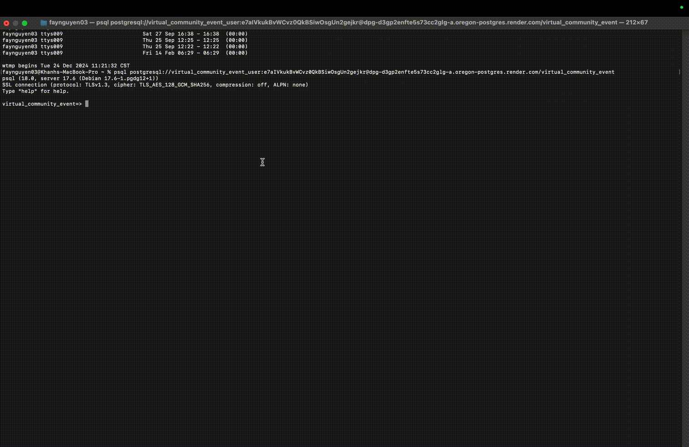

# WEB103 Project 3 - *Virtual Music Concerts*

Submitted by: **Khanh Tra Nguyen Tran**

About this web app: **A website displays all the virtual venues and the music concerts.**

Time spent: **8** hours

## Required Features

The following **required** functionality is completed:

<!-- Make sure to check off completed functionality below -->

- [X] **The web app uses React to display data from the API**
- [X] **The web app is connected to a PostgreSQL database, with an appropriately structured Events table**
  - [X]  **NOTE: Your walkthrough added to the README must include a view of your Render dashboard demonstrating that your Postgres database is available**
  
  - [X]  **NOTE: Your walkthrough added to the README must include a demonstration of your table contents. Use the psql command 'SELECT * FROM tablename;' to display your table contents.**
  
- [X] **The web app displays a title.**
- [X] **Website includes a visual interface that allows users to select a location they would like to view.**
  - [X] *Note: A non-visual list of links to different locations is insufficient.* 
- [X] **Each location has a detail page with its own unique URL.**
- [X] **Clicking on a location navigates to its corresponding detail page and displays list of all events from the `events` table associated with that location.**

The following **optional** features are implemented:

- [X] An additional page shows all possible events
  - [X] Users can sort *or* filter events by location.
- [X] Events display a countdown showing the time remaining before that event
  - [X] Events appear with different formatting when the event has passed (ex. negative time, indication the event has passed, crossed out, etc.).

The following **additional** features are implemented:

- [ ] List anything else that you added to improve the site's functionality!

## Video Walkthrough

Here's a walkthrough of implemented required features:

<!-- Replace this with whatever GIF tool you used! -->
GIF created with Kap
<!-- Recommended tools:
[Kap](https://getkap.co/) for macOS
[ScreenToGif](https://www.screentogif.com/) for Windows
[peek](https://github.com/phw/peek) for Linux. -->

## Notes

I was struggling with the routes. I want to specialize each route based on the name of the location.

## License

Copyright [2025] [Khanh Tra Nguyen Tran]

Licensed under the Apache License, Version 2.0 (the "License"); you may not use this file except in compliance with the License. You may obtain a copy of the License at

> http://www.apache.org/licenses/LICENSE-2.0

Unless required by applicable law or agreed to in writing, software distributed under the License is distributed on an "AS IS" BASIS, WITHOUT WARRANTIES OR CONDITIONS OF ANY KIND, either express or implied. See the License for the specific language governing permissions and limitations under the License.# web103_unit3_project